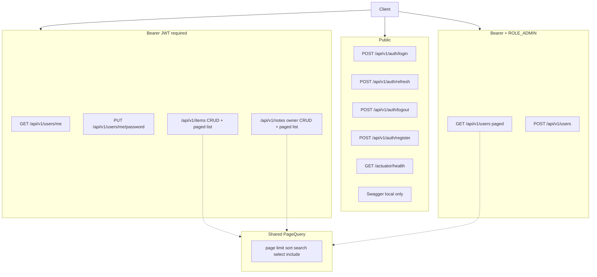

# Diagram: API surface

> **Living diagram** — update when endpoints are added/removed.

```mermaid
flowchart TB
  subgraph Public
    L[POST /api/v1/auth/login]
    R[POST /api/v1/auth/refresh]
    O[POST /api/v1/auth/logout]
    G[POST /api/v1/auth/register]
    H[GET /actuator/health]
    S[Swagger local only]
  end

  subgraph Bearer["Bearer JWT required"]
    UM[GET /api/v1/users/me]
    UP[PUT /api/v1/users/me/password]
    I["/api/v1/items CRUD + paged list"]
    N["/api/v1/notes owner CRUD + paged list"]
  end

  subgraph Admin["Bearer + ROLE_ADMIN"]
    UL["GET /api/v1/users paged"]
    UC[POST /api/v1/users]
  end

  subgraph ListQuery["Shared PageQuery"]
    Q["page limit sort search select include"]
  end

  I -.-> ListQuery
  N -.-> ListQuery
  UL -.-> ListQuery

  Client --> Public
  Client --> Bearer
  Client --> Admin
```
